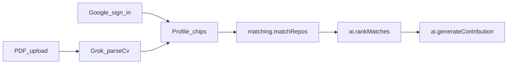

# Auth, CV i širi katalog

Cilj: student se uloguje Google-om, na profil okači PDF, Grok popuni jezike/stack/topics (isti chipovi kao ručni izbor), student ih izmeni, pa ide postojeći `matchRepos` → rank → contribution plan. Daytona ostaje van ovog cut-a (ne blokira plan).

Matching se **ne prepisuje**. [`src/lib/matching.ts`](src/lib/matching.ts), [`convex/lib/validators.ts`](convex/lib/validators.ts) i tabele `repositories` / `studentProfiles` se samo **proširuju optional poljima** u jednom dogovorenom PR-u.

## Raspodela — ko šta radi

### Ti (Lazar)

| Red | Šta | Branch / fajlovi |
|-----|-----|------------------|
| A | Google login + header Sign in/out | `feature/ui-auth` — `src/**`, `convex/auth.ts`, `convex/auth.config.ts`, `convex/profiles.ts` |
| B | PDF upload na profil + poziv `parseCv` + edit chipova | isti UI branch — `ProfileForm`, storage mutation |
| C | Session → user preliv posle login-a (guest i dalje radi) | `convex/profiles.ts` |
| D | Wonder polish (landing, profile, kartice) | tek posle A+B, samo `src/components/**` |
| E | Kasnije Phase 6: README, Render | `render.yaml`, README |

U **jednom freeze PR-u sa kolegom** (ne sam): `src/lib/catalogs.ts` (tvoja kopija liste) + optional polja na schema ako ti pišeš `userId` / `cvStorageId`.

### Kolega (AI + dataset)

| Red | Šta | Branch / fajlovi |
|-----|-----|------------------|
| 1 | Ista katalog lista + synonyms | `feature/ai-catalog` — `convex/ai/lib/catalog.ts` |
| 2 | 8–12 novih beginner repoа (embedded, DevOps, MLOps, FastAPI, …) | `data/verified-repos.json`, `convex/data/verifiedRepos.ts` |
| 3 | `parseCv` action: PDF tekst → Grok → samo chipovi iz kataloga | `convex/ai/parseCv.ts` (`"use node"`) |
| 4 | Env: `XAI_API_KEY` ostaje; Google secret može on ili ti u dashboardu | Convex dashboard, ne git |
| 5 | Daytona **ne sada** | — |

Ne dira `src/`, `MatchCard`, `matching.ts` / `scoring.ts` težine, `generateContribution` (osim ako parseCv treba sitnu pomoć oko kataloga).

### Freeze — jedan PR, oboje pregledaju, niko ne merge-uje sam

Isti commit / isti PR:

- `src/lib/catalogs.ts` **i** `convex/ai/lib/catalog.ts` (identične liste)
- `schema.ts`: optional `tokenIdentifier` / `userId`, `cvStorageId`, `cvFileName` — **ne preimenovati** postojeća polja
- `validators.ts` samo ako treba optional polje

Posle merge-a u `main`: ti auth/UI, on `parseCv` + repo JSON, paralelno. Dok freeze nije u `main`, ne editujte `schema.ts` u dva brancha.

### Šta niko ne radi

- Drugi matcher / score za CV
- Daytona, Wonder library import
- `npx convex deploy`
- Edit `convex/repositories.ts` (stari drugi `matchRepos`)

## Redosled (ne paralelno na istim freeze fajlovima)

1. **Katalog + 8–12 novih repoа** (freeze PR, oboje pregledaju)
2. **Google auth** (ti, `src/` + Convex auth wiring)
3. **CV upload + parse** (kolega action; ti UI)
4. **Wonder polish** na landing / profile / matches (ti, samo `src/`)
5. Phase 6: merge, Render, demo

Dok 1 nije mergovan, CV/auth mogu da se rade na branchu ali chipovi i seed moraju da postoje ili matching za embedded/MLOps vraća 0 kartica.

---

## 1. Katalog — zajednički freeze PR

Dva fajla moraju ostati **identična liste** (kao ne sad):

- [`src/lib/catalogs.ts`](src/lib/catalogs.ts)
- [`convex/ai/lib/catalog.ts`](convex/ai/lib/catalog.ts) (plus synonyms)

Dodati, bez brisanja postojećih:

- Jezici: `C`, `C#`, `Java`, `Kotlin`
- Stack: `Docker`, `Terraform`, `PyTorch`, `FastAPI`, `Arduino` / `PlatformIO`
- Topics: `embedded`, `mlops`, `firmware`, `cloud`, `systems` (`backend`, `devops`, `machine-learning` već postoje)

**Kolega** dopisuje 8–12 beginner-friendly repoа u [`data/verified-repos.json`](data/verified-repos.json) / [`convex/data/verifiedRepos.ts`](convex/data/verifiedRepos.ts) sa tim topicima (Zephyr/Arduino, FastAPI, Terraform/Ansible-docs, jedan MLOps/docs repo). Bez toga novi chipovi ne daju match.

Scoring u [`convex/lib/scoring.ts`](convex/lib/scoring.ts) ostaje; novi chipovi samo ulaze u overlap.

---

## 2. Google auth — ti

Stack: `@convex-dev/auth` + Google provider (ne passkey). Obavezno [`convex/auth.config.ts`](convex/auth.config.ts) ili klijent ostaje zauvek izlogovan.

- Install + `convex.config.ts` component; `convex/auth.ts` Google provider
- Env na **dev** Convex: `AUTH_GOOGLE_ID`, `AUTH_GOOGLE_SECRET`, `SITE_URL`, `JWT_PRIVATE_KEY`, `JWKS` (kolega ili ti u dashboardu; ključevi ne idu u git)
- Client: `ConvexAuthProvider` u [`src/app/ConvexClientProvider.tsx`](src/app/ConvexClientProvider.tsx); Sign in / Sign out u [`SiteHeader`](src/components/landing/SiteHeader.tsx)
- Profil: [`convex/profiles.ts`](convex/profiles.ts) — `getCurrent` / `upsert` preko `ctx.auth.getUserIdentity()`, ne samo `sessionId`
- Schema: na `studentProfiles` optional `userId` ili `tokenIdentifier` + index. **Ne dirati** `sessionId` odmah — posle login-a preliti session profil na user (jednokratni link) da se ne izgube chipovi
- `/matches` i contribution i dalje rade ako je profil tu; guest (localStorage session) ostaje dok se ne uloguje, da demo ne puca

Guest-only flow ostaje fallback ako Google console nije spreman na pozornici.

---

## 3. CV → chipovi — podela

**Ti (UI + storage wiring)**

- Na [`ProfileForm`](src/components/profile/ProfileForm.tsx): upload PDF (prvo samo PDF; DOCX kasnije ako stigne vreme)
- `ctx.storage.generateUploadUrl` + mutation koja čuva `cvStorageId` / `cvFileName` na profilu (optional, freeze PR)
- Posle uploada: `useAction(api.ai.parseCv.parseCv)` → popuni draft chipove
- Student **obavezno vidi i edituje** chipove, pa postojeći Save → `normalizeProfile` → `/matches`
- Ručni izbor ostaje; CV je prefill, ne drugi matcher

**Kolega (`convex/ai/parseCv.ts`, `"use node"`)**

- Čita fajl iz storage, izvuče tekst (npr. `pdf-parse`)
- Isti obrazac kao [`normalize.ts`](convex/ai/normalize.ts): Grok sme samo chipove iz kataloga
- Fallback: prazan parse → forma ostaje ručna, jasan error
- Ne zove `matchRepos` i ne piše `contributions`

Plan i dalje pravi `generateContribution`, ne “plan iz CV-a direktno”. CV samo hrani profil.

---

## 4. Phase 5 vizual / Daytona

- **Ti:** Wonder tek kad auth + CV ekrani postoje. Jedan prolaz: landing, profile (upload + chipovi), match kartica. Samo `src/components/**`.
- **Kolega:** Daytona **ne** u ovom nizu. Ako ostane dan posle CV-a — stub koji ne blokira plan. Inače jedna rečenica u pitchu.

---

## Vlasništvo (da se ne sudarate)

| Ko | Fajlovi |
|----|---------|
| Ti | `src/**`, `convex/profiles.ts`, `convex/auth.ts` / auth client, `render.yaml` ako treba SITE_URL |
| Kolega | `convex/ai/parseCv.ts`, `convex/ai/lib/catalog.ts` synonyms, `data/verified-repos.json` + seed JSON |
| Freeze, jedan PR | `schema.ts` (`userId`, `cvStorageId`), `validators.ts` ako treba, `src/lib/catalogs.ts` **isti commit** kao `convex/ai/lib/catalog.ts` |

Ne otvarati `repositories.ts` dual matcher. Ne `npx convex deploy` dok ne krenete Phase 6.

---

## Šta namerno nije u ovom cut-u

- Drugi score/ranker za CV
- Čuvanje istorije više CV-ova
- Magic link / passkey
- Wonder component library import
- Daytona sandbox izvršavanje PR-a
