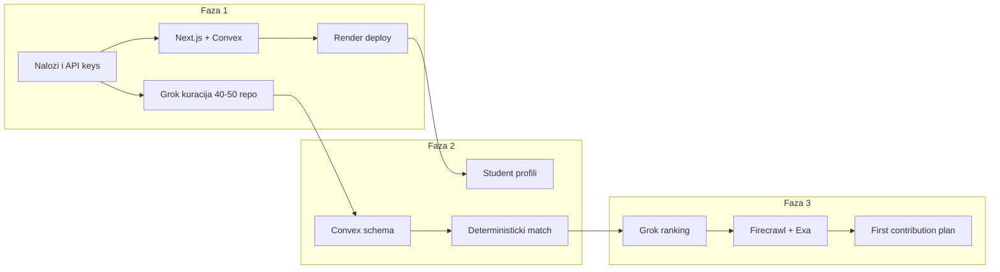
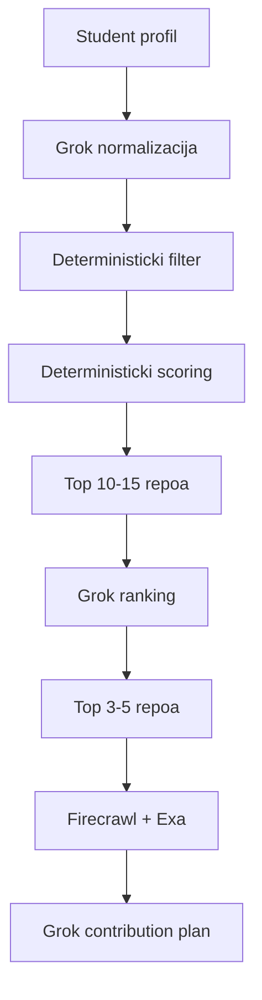

# FirstContrib — Faza 1 (Foundation)

## Kontekst

Repozitorijum je trenutno prazan ([`.gitignore`](.gitignore) jedini fajl). Cilj Faze 1 nije matching logika — već **infrastruktura + kurirani dataset + live deploy** koji omogućava brz ulazak u Fazu 2.



---

## 1. Nalozi i API ključevi

Kreirati checklist (`.env.example` + interni doc) sa svim servisima potrebnim kroz 3 faze. Za Fazu 1 su obavezni:

| Servis | Svrha u Fazi 1 | Env var |
|--------|----------------|---------|
| **GitHub** | Ručna verifikacija repoa, kasnije metadata | `GITHUB_TOKEN` (opciono u F1) |
| **Convex** | Backend + realtime DB | `NEXT_PUBLIC_CONVEX_URL`, `CONVEX_DEPLOY_KEY` |
| **Render** | Hosting Next.js frontenda | Auto kroz Dashboard |
| **xAI Grok** | Generisanje kandidata (offline u F1) | `XAI_API_KEY` |

Za Fazu 2/3 pripremiti (ne moraju odmah):
- `FIRECRAWL_API_KEY`, `EXA_API_KEY`

**GitHub remote:** Render zahteva push na GitHub/GitLab. Pre deploy-a: kreirati remote repo `FirstContrib` i push-ovati kod.

---

## 2. Grok → 60–70 kandidata → 40–50 verifikovanih repoa

Ovo je **offline kuratorski pipeline** (ne deo aplikacionog koda u F1), ali output mora biti u formatu spremnom za Fazu 2 import.

### 2a. Grok prompt za generisanje kandidata

Jedan batch prompt koji traži 60–70 repoa sa kriterijumima:
- Aktivni projekti (commit u poslednjih 6 meseci)
- Eksplicitni `good first issue` / `help wanted` / CONTRIBUTING.md
- Raznovrsni tech stackovi (JS/TS, Python, Go, Rust, Java)
- Različiti nivoi težine (beginner → intermediate)
- Mix veličina (500–10k stars, ne samo mega-projekti)

Za svaki repo Grok treba da vrati **strukturiran JSON**:

```json
{
  "owner": "vercel",
  "name": "next.js",
  "url": "https://github.com/vercel/next.js",
  "languages": ["TypeScript", "JavaScript"],
  "topics": ["react", "framework"],
  "stars": 120000,
  "hasContributingGuide": true,
  "hasGoodFirstIssues": true,
  "difficulty": "intermediate",
  "timeCommitment": "medium",
  "description": "..."
}
```

### 2b. Ručna verifikacija (40–50 repoa)

Za svakog kandidata proveriti ručno (5 min/repo):
- Repo postoji i nije arhiviran
- Ima otvorene issues sa `good first issue` labelom
- CONTRIBUTING.md ili sličan onboarding doc postoji
- Aktivnost u poslednjih 6 meseci
- Stvarno pogodan studentima (ne enterprise-only, ne zastareo stack)

Rezultat sačuvati u [`data/verified-repos.json`](data/verified-repos.json) — ovaj fajl postaje izvor istine za Fazu 2 seed.

### 2c. Kriterijumi kvaliteta (pass/fail)

- FAIL: arhiviran, nema otvorenih issues, nema CONTRIBUTING, poslednji commit > 1 god
- PASS: sve gore + bar 3 `good first issue` issues

---

## 3. Next.js + Convex scaffold

### 3a. Inicijalizacija

```bash
npx create-next-app@latest . --typescript --tailwind --eslint --app --src-dir
npm install convex
npx convex dev   # kreira convex/ i .env.local
```

Struktura projekta:

```
FirstContrib/
├── data/
│   └── verified-repos.json      # kurirani repoi (F1 output)
├── src/
│   ├── app/
│   │   ├── layout.tsx           # ConvexProvider
│   │   ├── page.tsx             # Landing
│   │   └── ConvexClientProvider.tsx
│   └── components/
│       └── landing/             # Hero, HowItWorks, CTA
├── convex/
│   ├── schema.ts                # prazan/minimalan u F1
│   └── health.ts                # ping query
├── .env.example
├── .gitignore                   # .env.local, node_modules, .convex
└── package.json
```

### 3b. Convex — minimalni backend (spreman za F2)

[`convex/schema.ts`](convex/schema.ts) — prazan schema ili placeholder komentar (F2 dodaje tabele).

[`convex/health.ts`](convex/health.ts) — javni query za proveru konekcije:

```typescript
export const ping = query({
  args: {},
  returns: v.object({ status: v.string(), timestamp: v.number() }),
  handler: async () => ({
    status: "ok",
    timestamp: Date.now(),
  }),
});
```

[`src/app/ConvexClientProvider.tsx`](src/app/ConvexClientProvider.tsx) — standardni Convex React provider sa `NEXT_PUBLIC_CONVEX_URL`.

### 3c. Landing page

[`src/app/page.tsx`](src/app/page.tsx) — hackathon-ready landing sa:
- **Hero:** "Find your first open source contribution"
- **Problem:** Zašto je prvi contribution težak
- **Solution:** Deterministički match + AI guidance (3 koraka)
- **Status indicator:** Convex `ping` query prikazuje "Backend connected" / "Connecting..."
- **CTA:** "Coming soon — student profiles" (placeholder za F2)

Dizajn: Tailwind, tamna/light tema, mobile-first. Bez auth u F1.

### 3d. ESLint + TypeScript

- Uključiti `@convex-dev/eslint-plugin` (preporuka iz Convex rules)
- `strict: true` u tsconfig

---

## 4. Rani Render deploy

### 4a. Build konfiguracija

[`package.json`](package.json) scripts:
```json
{
  "build": "next build",
  "start": "next start -H 0.0.0.0 -p $PORT"
}
```

Next.js na Render-u: bind na `0.0.0.0:$PORT` (Render platform constraint).

### 4b. Env vars na Render-u

| Var | Vrednost |
|-----|----------|
| `NEXT_PUBLIC_CONVEX_URL` | Convex deployment URL |
| `NODE_ENV` | `production` |

Convex backend se hostuje na Convex cloudu (ne na Render-u) — Render servira samo Next.js frontend.

### 4c. Deploy flow

1. Push na GitHub remote
2. Render Dashboard → New Web Service → povezati repo
3. Build command: `npm install && npm run build`
4. Start command: `npm start`
5. Dodati env vars
6. Verifikacija: landing live + "Backend connected" badge

Alternativa: [`render.yaml`](render.yaml) Blueprint za reproducibilnost (preporučeno za tim).

### 4d. Convex production

Kada je frontend spreman:
```bash
npx convex deploy   # SAMO za production Convex deployment
```

Dev tok ostaje: `npx convex dev` lokalno.

---

## Definition of Done — Faza 1

- [ ] Svi nalozi kreirani, `.env.example` dokumentovan
- [ ] `data/verified-repos.json` sa 40–50 ručno verifikovanih repoa
- [ ] Next.js + Convex scaffold radi lokalno (`npm run dev` + `npx convex dev`)
- [ ] Landing page prikazuje Convex health status
- [ ] Kod push-ovan na GitHub
- [ ] Live deploy na Render sa funkcionalnim Convex konektovanjem
- [ ] Tim može odmah krenuti Fazu 2 (schema + import repoa)

---

## Pregled Faza 2 i 3 (za kontekst, ne implementacija sada)

### Faza 2 — Data + Baseline
- Convex tabele: `repositories`, `studentProfiles`, `matchResults`
- Seed mutation: import iz `verified-repos.json`
- Student profile UI forma (skills, languages, experience, time commitment, interests)
- Deterministički filter (hard constraints) → scoring (weighted sum) → top 10–15
- Test sa 5 mock profila

### Faza 3 — AI Layer
- Grok normalizacija student profila
- Grok ranking top 10–15 → final 3–5
- Firecrawl: README, CONTRIBUTING, docs, issues scraping
- Exa: enrichment gde Firecrawl ne pokrije
- Grok: generisanje "first contribution" plana i "next contribution" predloga



---

## Rizici i mitigacije

| Rizik | Mitigacija |
|-------|------------|
| Grok generiše nepostojeće repoe | Ručna verifikacija obavezna |
| Render free tier spin-down | Prihvatljivo za hackathon demo; warm-up pre prezentacije |
| Convex auth nije u F1 | Namerno — auth dolazi u F2 sa student profilima |
| Dataset bias (samo JS projekti) | Eksplicitno tražiti diversity u Grok promptu |
