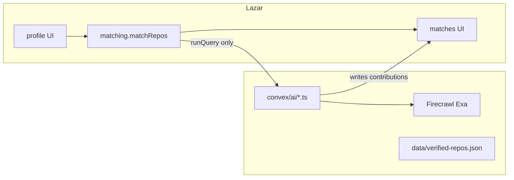

# Raspodela rada bez merge conflict-a

## Stanje posle usklađivanja

Kod je usklađen, ali postoje **dva matching puta**:

- [`convex/matching.ts`](convex/matching.ts) + [`convex/lib/scoring.ts`](convex/lib/scoring.ts) — **UI već zove** `api.matching.matchRepos`
- [`convex/repositories.ts`](convex/repositories.ts) + [`convex/lib/matching.ts`](convex/lib/matching.ts) — drugi `matchRepos`, UI ga ne koristi

**Odluka:** jedini ugovor je `api.matching.matchRepos`. Kolega iz actions zove taj query (`ctx.runQuery`). Ne piše drugi ranker preko `repositories.matchRepos`. `repositories.ts` ostaje za seed/facets/sample profile-e dok se ne spoji u `seed.ts` — nove AI stvari ne idu tamo.

Zamrznuti contracti (ne menjati polja bez dogovora):

- [`src/lib/matching.ts`](src/lib/matching.ts)
- [`convex/lib/validators.ts`](convex/lib/validators.ts)
- [`convex/schema.ts`](convex/schema.ts) — tabele `repositories` i `studentProfiles`

Kolega sme samo da **dodaje optional polja** ili **nove tabele** (`repoDocuments`, `aiRankings`) u svom PR-u. Ne preimenuje postojeća polja.

---

## Pravilo koje sprečava conflict

Svako ima **svoje fajlove**. Ako treba izmena tuđeg fajla — kratak PR, jedan po jedan, ne paralelno.

**Branching:**

- Ti: `feature/ui-*` ili nastavak na app/infra
- Kolega: `feature/ai-*`
- Oba sa istog usklađenog `main`
- Merge u `main` često (sitni PR-ovi), ne jedan veliki branch do kraja hackathona

---

## Mapa fajlova

**Samo ti**

- `src/app/**`
- `src/components/**`
- `src/lib/session.ts`, `src/lib/catalogs.ts`
- `convex/matching.ts`, `convex/lib/scoring.ts`
- `convex/profiles.ts`, `convex/health.ts`
- `convex/fixtures.ts` (UI `/fixtures`)
- `render.yaml`, Next/Render config

**Samo kolega**

- Novi folder [`convex/ai/`](convex/ai/) — `normalize.ts`, `rank.ts`, `enrich.ts`, `contribute.ts` (`"use node"` actions)
- Nova tabela npr. `repoDocuments` (samo on je dodaje)
- [`data/verified-repos.json`](data/verified-repos.json) + [`data/grok-curation-prompt.md`](data/grok-curation-prompt.md)
- Convex dashboard env: `XAI_API_KEY`, `FIRECRAWL_API_KEY`, `EXA_API_KEY`

**Zajednički — freeze, PR samo uz dogovor**

- `convex/schema.ts`
- `convex/lib/validators.ts`
- `src/lib/matching.ts`
- `convex/seed.ts` / `convex/data/**` / `convex/repositories.ts` (dataset + seed; kolega menja JSON, ti seed kod ako mora)

---

## Raspodela po fazama

### Phase 2 — Data + Baseline (skoro gotovo)

| Stavka | Ko | Fajlovi |
|--------|----|---------|
| 6 Schema | Freeze | `schema.ts` / `validators.ts` |
| 7 Seed 46 repoa | Kolega = sadržaj JSON; ti = `seed.ts` ako se pokvari | `data/verified-repos.json` vs `convex/seed.ts` |
| 8 Profile UI | Ti | `src/components/profile/**` |
| 9 Profile → Convex | Ti | `convex/profiles.ts` |
| 10–11 Filter + score | Ti | `convex/matching.ts`, `convex/lib/scoring.ts` |
| 12 Pet profila | Ti UI `/fixtures`; kolega sme da doda persona u JSON, ne u `fixtures.ts` | |

Phase 2 za tebe: polish forme/kartica, spojiti UI na `getFacets` **samo ako** kopiraš rezultat u `src/lib/catalogs.ts` — ne edituj `repositories.ts` u istom PR-u kao kolega.

### Phase 3 — AI (samo kolega)

13–19: Grok normalize, rank top 10–15 → 3–5, Firecrawl, Exa, first/next contribution.

**API ugovor koji ti kasnije zoveš (on implementira, ti ne pišeš):**

- `api.ai.rankMatches` — args: `{ sessionId }` ili lista `repositoryId`; internally `ctx.runQuery(api.matching.matchRepos, { sessionId, limit: 15 })`; returns top 3–5
- `api.ai.enrichRepo` — args: `{ repositoryId }`; writes `repoDocuments`
- `api.ai.generateContribution` — args: `{ sessionId, repositoryId, kind: "first" | "next" }`; inserts `contributions`

On **ne menja** scoring težine i **ne menja** `MatchCard`. Ako UI treba novo polje (`planTitle`), dodaje optional na `contributions` (već postoje `title`, `steps`, `issueUrl`) — ti samo čitaš.

### Phase 4 — Product (samo ti)

20 Result cards — [`MatchCard.tsx`](src/components/matches/MatchCard.tsx), nova ruta npr. `/matches/[id]`
21 Mark as completed — nova mutacija **tvoja** u `convex/contributions.ts` (samo `status` / `completedAt`; ne Grok)
22 Recommendation refresh — ponovo zove `matchRepos` + ako postoji `ai.rankMatches`
23 UI polish — landing / profile / matches

Kolega u Phase 4 ne dira `src/`.

### Phase 5 — Optional

| Stavka | Ko |
|--------|----|
| 24 Daytona verification | Kolega (`convex/ai/daytona.ts`) |
| 25 Wonder / visual | Ti (`src/components/**` only) |

### Phase 6 — Final

| Stavka | Ko |
|--------|----|
| 26–27 E2E / edge UI | Ti |
| 28 Prod AI env vars | Kolega (Convex dashboard) |
| 29 Render redeploy | Ti (`render.yaml`, `NEXT_PUBLIC_CONVEX_URL`) |
| 30–31 Demo / pitch | Zajedno, van koda |

---

## Integracija bez diranja tuđih fajlova

1. Kolega merge-uje `convex/ai/*.ts` — UI i dalje radi na determinističkom `matchRepos`.
2. Ti u `MatchesPageClient.tsx` zameniš/dodaš `useAction(api.ai.rankMatches)` — **samo taj jedan frontend fajl**.
3. Contribution view čita `contributions` query koji ti napišeš u `convex/contributions.ts` (tanki read/update). Kolega samo `insert`-uje iz action-a.

Ako action još ne postoji, UI ostaje na deterministic top 5 — nema blokade.

---

## Šta sad uraditi (pre novog koda)

1. Oboje potvrdite: **`api.matching.matchRepos` je jedini matcher.**
2. Kolega otvara `feature/ai-phase-3` i pravi prazan `convex/ai/` — ne otvara `schema.ts` dok ne treba `repoDocuments`.
3. Ti ostaješ na UI polish / Phase 4 pripremi u `src/` i eventualno `convex/contributions.ts`.
4. `TEAM.md` nije obavezan; ovaj plan je dovoljan checklist.

**Ne raditi sada:** prepisivanje `repositories.ts` u istom PR-u kao AI start — to je konflikt-magnet. Cleanup dual-matching kasnije, jedan PR, samo ti.
